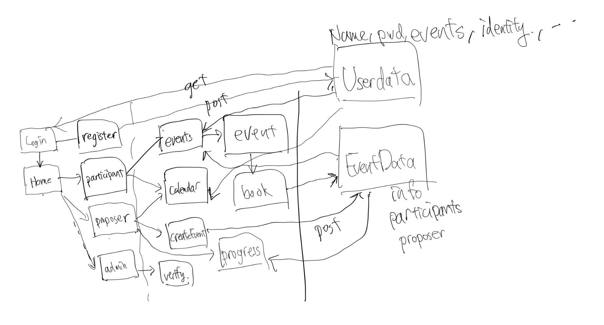
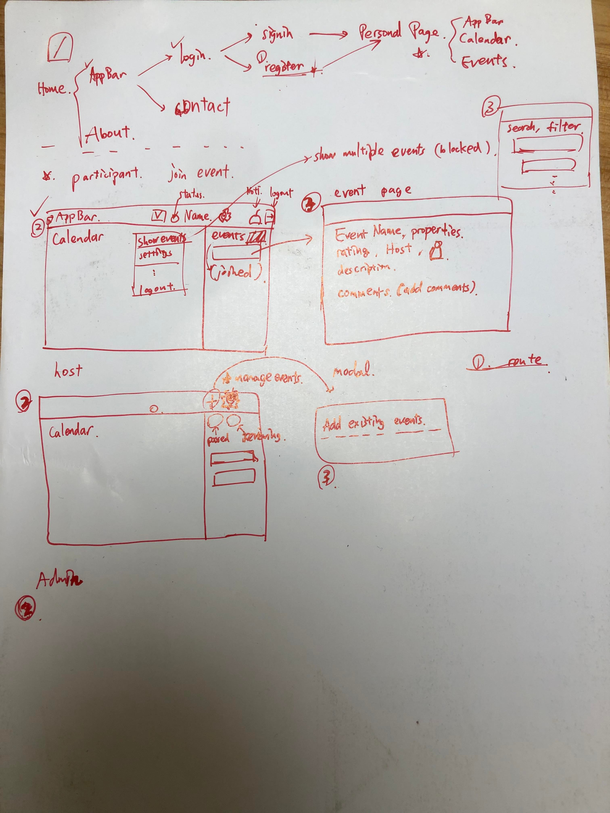

# NTURentPE -> 自動排程的預約網站

## Framework

- Client: participants, proposers, and admins
- Interface: Homepage, login, calendar, events, verify...
- Ideas: login 時選擇角色，calendar 顯示個人行程，events 更新最新活動訊息，create event 要有審核條件，每項 event 結束後會有 feedback 功能。

## Discussions ＆ TODOs

### Week 1(12/05)

#### Discussion

- Create framework, flow, some ideas about the project

#### TODOS

Frontend:

- [x] Homepage (a button navigating to login page)
- [x] login
- [x] register
- [x] After successful login, navigate to corresponding user's page

### 12/27

#### TODOS

- [x] Register page
- [x] routes
- [x] participant page
- [x] host page
- [ ] event pages & template

### 1/2

- [x] autoLogin(jwtKey)
- [x] Logout
- [x] Admin page
