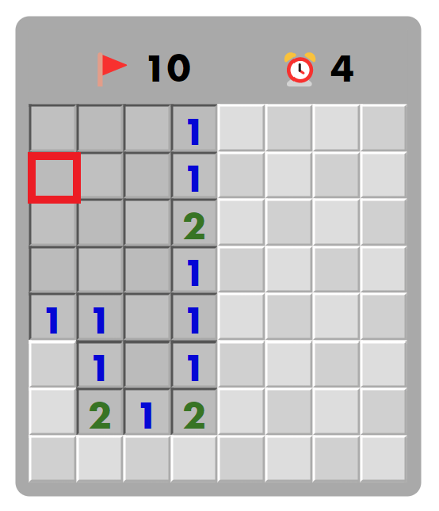
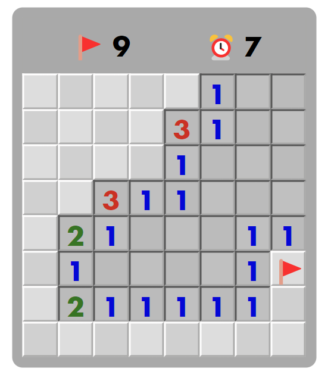
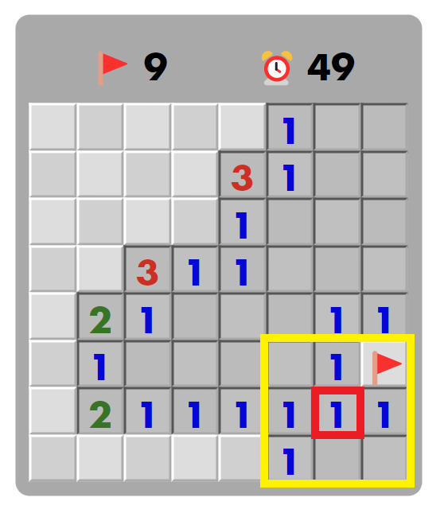
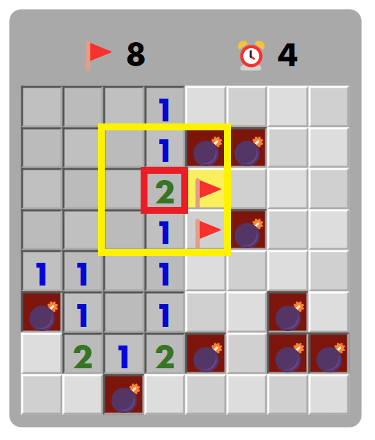

# Web Programming HW#4

###### Author: b10901038 吳典叡

### Run Program

```
// Download node_modules
npm install

// Run
npm start (or yarn start)
```

## Basic features

1. Implemented _Homepage_ features
   - Implemented **Start Game** button: start game by triggering the button
   - _Board_ page shall appear when pressed **Start Game** button; also, _Homepage_ will be hidden
2. Implemented _Board_ page features
   - Implemented `freshBoard` function: set parameters for the newly created Board by hooks
   - Construct the Board with given paremeter `boardSize`, which denotes the side length of the Board
     - Each unit block is created by _Cell_ component
     - Nested `map` function
   - Implemented `updateFlag` function
     - Triggers by rightclicking the cell
     - If the cell is revealed, then denies the request
     - If unflagged, set the cell flagged
     - If flagged, set the cell unflagged
     - Updates `board` and `remainFlagNum`
   - Implemented `revealCell` function
     - If not revealed, then reveal that cell by calling `revealed` function
     - If clicked on the cell with a bomb, then set `gameOver` true
     - Otherwise if all blocks without a bomb are revealed(i.e. `nonMineCount` is 0), then set `win` true
     - Otherwise continue game
     - Updates `board` and `nonMineCount`

## Advanced features

1. Implemented "Difficulty Adjustment" function
   - Implemented **Difficulty Adjustment** button: expands Control Panel when triggers the button, and hides Control Panel when clicks on it again
   - Implement two "range type" `input` components, each of which represents **Mines Number** and **Board Size**, user can adjust their values by scrolling over the corresponding joystick.
   - When the given parameters are invalid to start game, then an error occurs, user can't start game either (**Start Game** button will be unavailable until error disappears).
2. Reconstruct `revealed` function
   - When click on the cell with value = 0, then reveals all the adjacent cells with value = 0, and also reveals the cells adjacent to them [1]
   - when there is a cell to be revealed which is flagged, then remove the flag from the block automatically and increment `remainFlagNum`
   - Update `board`, `nonMineCount`, `remainFlagNum`
3. Implemented _Modal_ page
   - Show _Modal_ page when the game is over (either win or lose)
   - Composed of a text message and two functional buttons, representing _Start New Game_ and **Back to Home** respectively
   - If the user won the game, then "You WIN" will be presented in text message; conversely, "Game Over" will be presented
   - If the user won the game, then **New Game** text will be presented in _Start New Game_ button, otherwise **Try Again** will be presented
   - Press _Start New Game_ button will create a new board, and user shall continue new game
   - Press **Back to Home** button will return to _Homepage_
4. Implement Timer in _Dashboard_ page
   - Starting from 0 when new game is constructed
   - Stops the timer and show the time when the game is over (either win or lose)

## Additional features

1. Additional reveal rules

   - When `nonMineCount` = 0, then put flags on all the unrevealed cells (these cells are guaranteed bombs)
   - When specific number of flags(value of cell) are put around the cell, then click on the cell will reveal all cells adjacent to it(excluding flagged cell) [2]
   - When clicked on a bomb(including revealing the wrong adjacent cells), then all the bombs on the board will be revealed, also, the wrongly flagged cell (the cell that user thought there will be a bomb but in fact it is not bomb) will be highlighted.

2. Change style render rule for _Cell_ component: wrongly flagged cell will be hightlighted when the game is over

#### Supplements

[1]:

An example of revealing cells when click on the red box shown(initially unrevealed):


[2]:




Click on the red box will reveal all adjacent blocks(cells show in yellow box, red box must be revealed)

An example of wrong flagging while revealing adjacent cells:



Tips: Although it violates the original rule in hw, the online minesweeper website exist such rules, so I managed to implement this feature.
